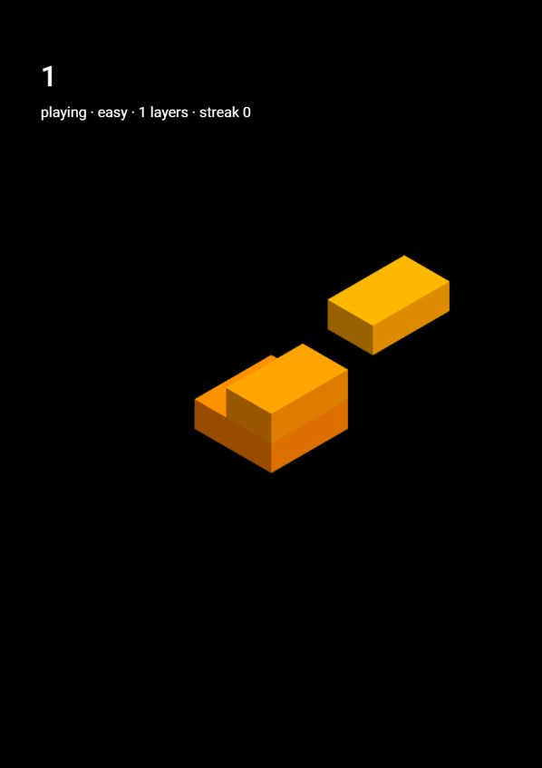

# A·玩法 分支成果

## 当前可运行状态

实现简单 / 普通难度、完美对齐（不裁切）、连击递增奖励（每层 1–5 分）、层数与得分分离、重开清空状态。保留原视觉，页面加入最小难度控件与状态文本。

玩法核心与状态接口为提交 22bbdfd；B / C 引入同一补丁后各自实现视觉或界面。

## 接口

setDifficulty(easy | normal) 仅开始前有效；getSnapshot() 返回副本；tower-drop:state 更新 score、layers、perfectStreak、phase、lastResult；tower-drop:landed 提供 perfect 与方块索引。核心判断完美，UI 和美术只消费结果。

## 验证

本地 lint、类型检查、61 项 Jest 测试和生产 build 通过。新增测试覆盖实际核心交互、双轴完美、连击、裁切、零重叠失败、重开和控件防误触。B 额外验证材质发光与恢复；C 额外验证难度、HUD、结束和重开完整流程。

浏览器 WebGL 已运行；A 验证简单难度开始与真实落块计分，B 验证场景与真实落块计分，C 验证难度选择、开始、失败总结、重开。自动化 WebGL mock 测试不等于全部实机验收；窄屏 CSS 已实现，尚未逐个设备实测。bundle >500kB 为继承的构建警告，不阻止构建。

## 课堂使用

在本工作区运行 npm run dev -- --host 127.0.0.1 --port 3101。课堂 main / classroom-start 是原始起点，不会自动包含三个角色成果；本次没有合并 main。

正常角色 HEAD 不包含故障。功能冲突演示使用单独 demo/c-ui-event-conflict 分支：UI 监听的事件名与核心发送的不一致，界面不能同步，已有集成测试应失败。原先单改 score 类名的故障在状态接口下不再是可靠演示，不能照搬。
