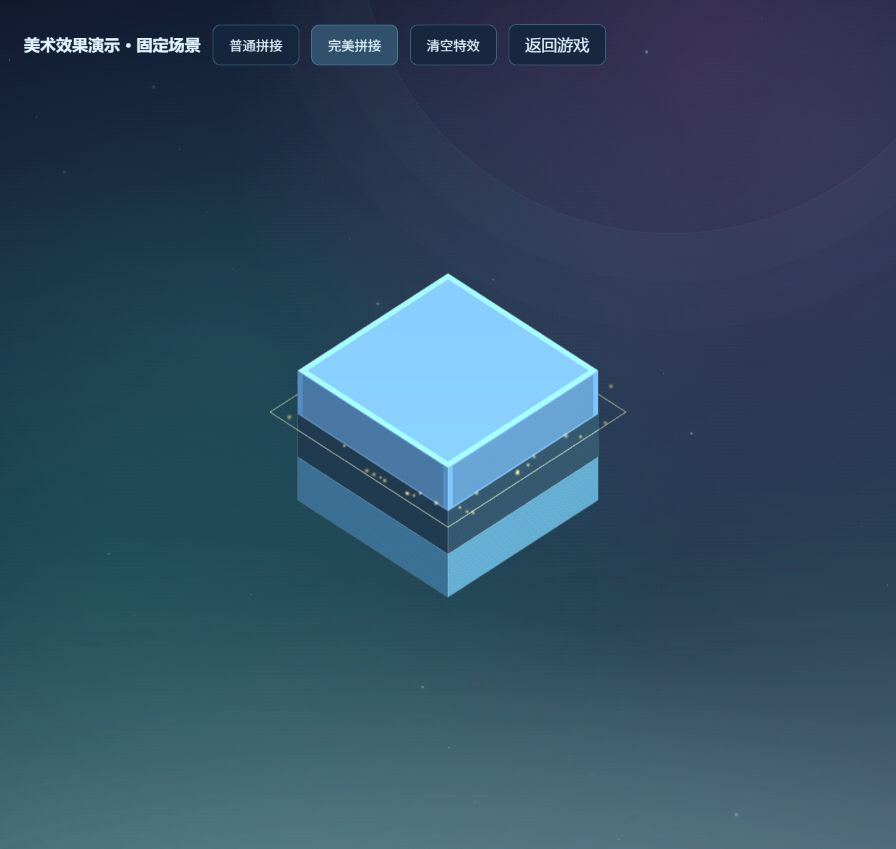

# B·美术 分支成果

## 当前状态

动态青蓝/紫色渐变背景、远景星点、冷暖灯光；指数距离雾与缓慢漂移的低位雾片增加空间层次。雾片是透明背景层，配合 Three.js FogExp2，**不是光线步进体积雾**。

塔层循环使用陶瓷、拉丝金属、自发光材质，使用程序生成的 64×64 纹理，无需下载外部素材。碎块继承对应塔层材质，细线描边强调接缝。普通成功出现青色边缘粒子，完美成功出现更密集、更持久的金色粒子与扩散矩形轮廓，同时塔块短暂发光，随后恢复原材质的自发光强度。

本分支继承 A 的玩法核心提交 22bbdfd（cherry-pick）；相对 main 的差异包含该依赖。核心计算 perfect，美术消费 tower-drop:landed。落块事件改为在裁切完成后发出，使粒子使用实际接缝尺寸；事件名与数据格式保持兼容。

## 六次提交与教学节奏

| 步骤 | 提交        | 改动                                       | 课堂观察                 |
| ---- | ----------- | ------------------------------------------ | ------------------------ |
| 1    | f4025f8     | 动态渐变、星点、远景轨道                   | 只改背景即可产生可见成果 |
| 2    | 3f51a71     | 距离雾与低位动态雾片                       | 讨论效果与渲染成本       |
| 3    | 0d6f533     | 三种材质、程序纹理、接缝轮廓               | 查看资源创建与释放的配对 |
| 4    | 9c68817     | 普通成功粒子、裁切后事件                   | 美术如何依赖玩法接口     |
| 5    | 107c640     | 完美金色粒子、扩散轮廓、演示页             | 同一事件产生不同反馈     |
| 6    | 本分支 HEAD | 资源清理、减少空闲更新、生产演示入口与验收 | 查看完整 PR 与验证证据   |

备课时按以上顺序推进，每步可运行、验收、再提交。45 分钟课堂不必现场编写全部效果：约 5 分钟比较起点与成果，8 分钟展示分支/提交历史与单步 Diff，12 分钟演示三角色 PR 与接口依赖，12 分钟演示独立功能冲突分支及修复，8 分钟验证、回顾与学生练习。美术六步作为提交历史素材。

每步截图在 [art-stages](screenshots/art-stages)。01–04 为游戏画面；05–06 为固定场景效果演示。

## 启动与验收

在 B 工作区运行 `npm run dev -- --host 127.0.0.1 --port 3102`。

- 游戏：<http://127.0.0.1:3102/>，实际成功拼接触发粒子，失败/重开清空特效。
- 演示：<http://127.0.0.1:3102/art-lab.html>，可重复点击普通、完美、清空，不需要手速命中。明确标为固定场景，不计分。生产构建也包含此入口。
- 本地检查：lint、type-check、65 项 Jest 测试和生产 build。粒子/轮廓测试覆盖容量上限、过期、清空及重复释放，玩法测试仍验证双轴完美、裁切、计分与重开。

粒子固定 160 槽、轮廓固定 6 槽，空闲时停止上传粒子属性；像素比限制为 2。背景支持减少动画偏好。游戏初始化及窗口变化时调整渲染尺寸，避免每帧重复设置尺寸。重开释放塔块纹理与描边；dispose 释放粒子和轮廓缓冲并防止重复释放。

实际浏览器验收包含游戏启动、真实落块计分、失败重开，以及演示页普通/完美效果和清空。性能优化是实现层面的约束，尚未进行不同教学机 GPU 的 FPS 基准；多入口构建把共享 Three.js/美术模块单独打包，最大单个 JS 包约 421kB，本次构建未出现 >500kB 警告；整体加载体积仍包含 Three.js。GitHub CI 是否运行需另外查看，不能把本地通过等同远端 CI 通过。

## 分支边界

本次只推进 feature/b-art，未合并 main，也未把效果搬到 A/C。main / classroom-start 继续作为课堂原始起点。功能冲突使用单独 demo/c-ui-event-conflict：UI 监听错误的状态事件名，出现无文本冲突但功能失败，已有集成测试应失败。正常角色分支不植入故障。
