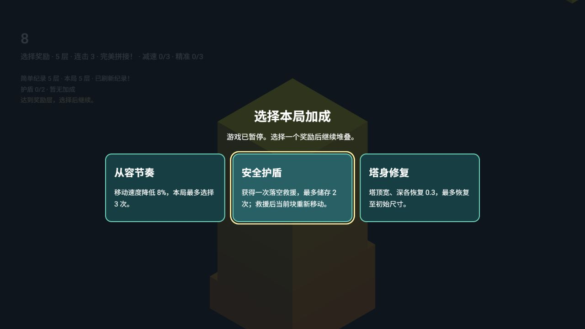
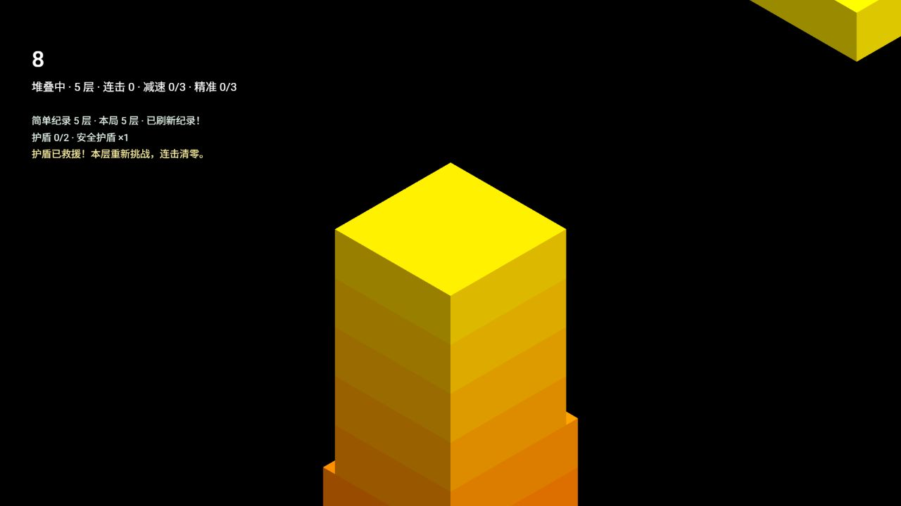
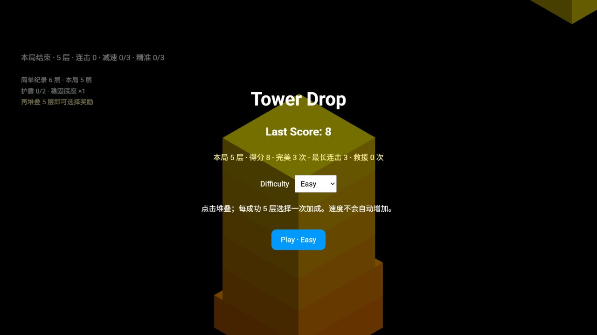

# Gameplay 玩法深化成果

## 范围与当前交付

在教师通过 Rider 提交的第一阶段（f41f900；当前 HEAD d1dc810）之上完成后续玩法。教师已在 Rider 提交主要改动 e1835f5。创建 PR 前补齐遗漏的新模块、测试和验收材料，并推送完整成果。未改动 main 或 B/C 工作区。

目标是持续堆叠、选择成长和刷新最高层数，没有自动加速、随机负面道具或奖励稀有度。

## 完整循环

每成功 5 层检查奖励池，随机抽取最多三种不重复选项，暂停游戏等待选择。选择期间禁止落块与难度变更；只接受当前奖励 ID 一次。恢复时重设动画时钟，不累计暂停时间。失败后查看本局统计，再开一局清空全部加成与护盾。

| 加成     | 效果                                                    | 上限                             |
| -------- | ------------------------------------------------------- | -------------------------------- |
| 塔身修复 | 当前塔顶及下一移动块的宽/深各增加 0.3                   | 初始尺寸 3；恢复满尺寸时不再提供 |
| 从容节奏 | 速度每次乘 0.92                                         | 3 次，累计约减速 22%             |
| 精准辅助 | 完美范围每次增加基础的 20%                              | 3 次，最多基础的 1.6 倍          |
| 安全护盾 | 完全落空时消耗 1 次，当前块重新从塔顶一侧移动，连击归零 | 储存 2 次；不增加层数或分数      |
| 完美修复 | 完美落块后宽/深各恢复 0.03 × 等级                       | 3 级；恢复不超过初始尺寸         |
| 稳固底座 | 普通落块后恢复当次裁切损失的 15% × 等级                 | 3 级，最高 45%；对应实际裁切轴   |

任一塔顶边长 <1.8 时保证提供塔身修复。满级加成与已存满的护盾不再抽取；候选不足三项时显示实际候选，所有奖励都已无用时跳过该奖励节点，继续堆叠，避免空弹窗或强迫选择无效奖励。

修复后的逻辑尺寸、模型几何、缩放及碰撞体统一更新，下一移动块继承修复尺寸；恢复以当前中心向两侧展开，允许塔顶略宽于下层。碎块保留实际裁切时的大小，已经离开镜头的碎块释放几何、材质和物理对象。

## 成长与纪录

HUD 展示当前层数、连击、距下次奖励的层数、护盾余量和已选择加成。结算展示层数、得分、完美次数、最长连击和救援次数。最高层数按 easy/normal 分别保存，刷新页面保留；本局刷新纪录时给出提示。

纪录只属于当前浏览器与当前网站地址，不是云端排行。localStorage 不可用时仍可游戏并保持当前会话纪录；损坏或非法纪录值回退为 0。

## 协作接口与课堂案例

- GameSnapshot 新增 reward 阶段、rewards、rewardChoices、layersUntilReward、shields、rescuesUsed、perfectCount、longestStreak、bestLayers、recordBroken。嵌套数据也返回副本。
- chooseReward(id) 由核心验证并应用，成功返回 true；UI 不直接修改物理或速度。
- tower-drop:landed 在裁切与持续修复完成后发送，提供 perfect/index。
- tower-drop:reward-applied 提供 id/index（已落下的塔顶索引）；tower-drop:rescued 提供 index（重新移动的当前块）。供 B 后续接入动画反馈。

推荐教学功能冲突：C 的卡片点击仅隐藏弹窗，没有调用 chooseReward，游戏停在 reward 阶段。Git 可自动合并，但实际不能继续。验收应同时检查弹窗消失、phase 恢复、动画恢复和没有额外落块；页面集成测试覆盖这条完整链路。正常 gameplay 分支没有故意加入故障；旧 demo/c-ui-event-conflict 分支仍保留独立故障演示。

B/C 尚未接入这次新接口。B 的重建几何会涉及描边资源同步，奖励阶段的反馈清理条件也需要整合时确认；不能直接把 A 覆盖到 B 而宣称美术已集成。

## 验收证据

本地 lint、type-check、78 项 Jest 测试、生产 build 通过。覆盖盾牌消耗、两次储存上限、持续修复双轴、随机候选不重复、危急修复保证、满级过滤、无候选跳过、独立难度纪录、损坏/不可用存储、页面结算和重开。150 次成功落块、30 个奖励节点的模拟检查通过；这不是实机 FPS 或随机玩家平衡测试。

真实 WebGL：简单难度五次落块打开随机三选一，选择护盾后实际落空成功救援，层数仍 5、连击清零；随后继续到 6 层。刷新页面后简单纪录为 6，普通纪录为 0。另一次实际游戏选择稳固底座并失败，结算显示 5 层、8 分、3 次完美、最长连击 3。重开清空加成由页面集成测试和此前实机流程共同验证。浏览器控制台无错误。

持续修复的精确数值与高等级上限主要由自动化验证；没有完成多设备、长时间 GPU 压测或用户样本平衡研究。生产包仍有继承的 >500kB 提示，不阻止构建。

## Rider 提交安排

主要改动已由教师在 Rider 提交；后续补齐新文件的提交用于确保远端可运行。建议后续迭代使用说明：

`feat(gameplay): 完成续航加成随机奖励与纪录结算`

后续课堂若需要按阶段讲解，可以按护盾/持续修复、随机抽取、成长/纪录、验收四组查看 Diff；不要把当前相互依赖的文件任意拆开后当成可运行版本。
