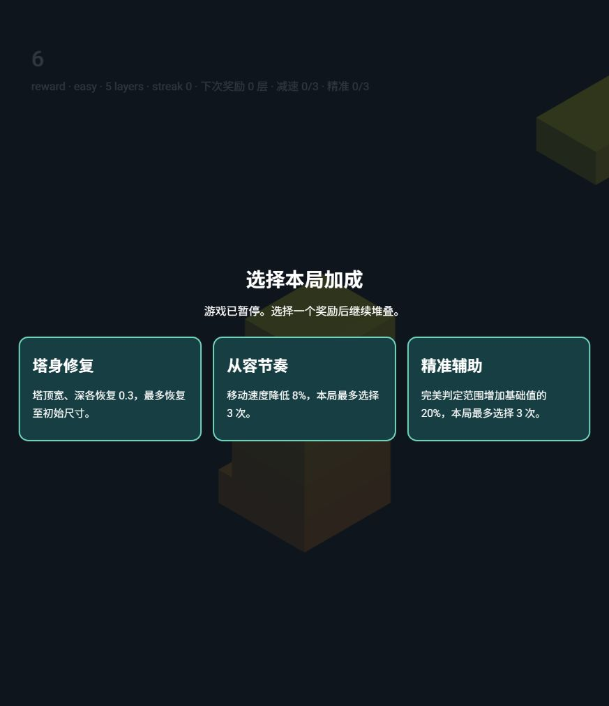

# Gameplay 第一阶段：奖励循环

工作区：member-a-gameplay；分支：feature/a-gameplay。实现与验收完成后保持未暂存、未提交、未推送，留给教师在 Rider 内完成 Commit。此次没有推进第二阶段或整合 B/C。

## 可玩内容

每成功堆叠 5 层进入 reward 阶段，冻结移动、物理和场景，显示奖励卡。选择一次后继续；卡片点击不会额外落块。现阶段仅有三种基础奖励，不随机洗牌、不引入稀有度。

- 塔身修复：塔顶宽、深各恢复 0.3（初始尺寸的 10%），上限 3；同步下一移动块、模型几何、缩放和碰撞体。保持塔顶中心位置，允许形成轻微向外扩展的平台。
- 从容节奏：每次速度乘 0.92，最多 3 次，累计减速约 22%。不自动加速。
- 精准辅助：每次增加基础完美容差的 20%，最多 3 次，总容差最高为基础的 1.6 倍。

满级选项从后续卡片中移除，因此第一阶段的后期奖励可能少于三张；修复始终可选，已满尺寸时没有额外收益。更多候选与根据危险程度抽取留在后续阶段。所有奖励在失败后的新一局清零。

## 协作接口

GameSnapshot.phase 新增 reward；新增 rewards、rewardChoices、layersUntilReward。getSnapshot 与状态事件对嵌套数据也返回副本。

chooseReward(id) 仅在 reward 阶段接受当前候选，成功返回 true；过期、重复、满级或未知候选返回 false。玩法核心应用效果并恢复运行，UI 只提供选项 ID。

新增暂停阶段后，B/C 在后续集成时需要分别处理奖励期间的视觉反馈和界面。特别是此前 B 的“非 playing 清理特效”逻辑会在 reward 阶段也执行，应在整合时明确所需行为。

原移动代码按每帧固定步长推进，实机验收发现节奏受帧率影响。本次改用时间差推进，保持 60Hz 下原速度；恢复运行时重设时钟，单帧时间差上限 50ms，避免暂停后的跳跃。

## 验收

本地 lint、type-check、67 项 Jest 测试、生产 build。新增检查覆盖五层/十层触发、奖励时拒绝落块与改难度、选择一次、满级过滤、双轴修复与碰撞尺寸、减速与完美判定、快照隔离、重开清空、页面卡片交互以及不同刷新率。

浏览器真实 WebGL：简单难度堆叠五层，显示三张奖励卡；间隔 1.2 秒的两张截图完全一致，验证场景冻结；点击塔身修复后恢复 playing，仍为五层，无额外落块。开始、失败与重开另行验证。其他两种奖励的精确数值由自动化测试验证。未进行不同 GPU 的性能基准或移动设备验收。Three.js 单包 >500kB 构建提示仍存在。

## Rider 自行提交

打开 B:\GithubProject\tower-drop-classroom\member-a-gameplay，确认 feature/a-gameplay。Commit 面板查看本阶段的源文件、测试、本文档和截图差异，勾选后执行 Commit。推荐提交说明：

`feat(gameplay): 每五层奖励选择与修复减速精准加成`

本阶段可作为一次完整功能提交；此前两次提交的规划是开发节奏，当前未建立任何提交。首次体验可先仅 Commit，本地检查或 hook 有报错时修复后再提交。
