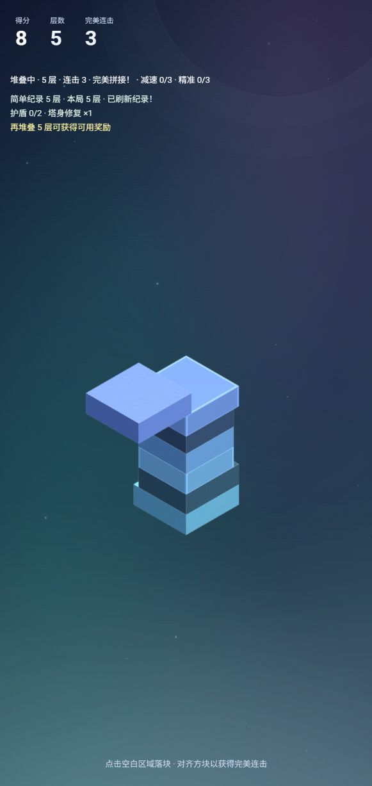
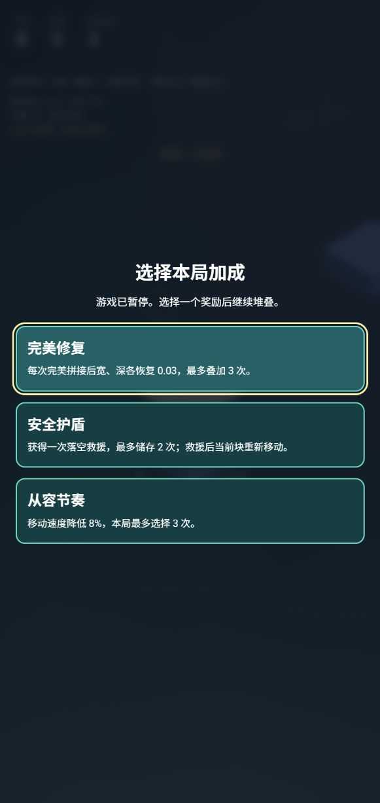

# 三人协作最终整合说明

验收日期：2026-10-07。教学仓库：TeutonicMepheles/tower-drop-classroom。

## 合并顺序

1. [PR #4：A·玩法](https://github.com/TeutonicMepheles/tower-drop-classroom/pull/4)：奖励、续航、纪录与结算。
2. [PR #5：B·美术](https://github.com/TeutonicMepheles/tower-drop-classroom/pull/5)：动态背景、雾效、材质、粒子与完美光环。先将最新 main 合入 B，解决玩法核心的冲突，再合并 PR。
3. [PR #6：C·UI](https://github.com/TeutonicMepheles/tower-drop-classroom/pull/6)：中文菜单、难度单选、HUD。先将含 A/B 的 main 合入 C，保留最新核心并适配奖励弹窗、成长展示和结算。

保留角色分支和所有历史提交，使用 merge commit 展示协作过程。main 与三个角色工作区最终同步到整合版本；阶段成果可从 Git Log 和阶段文档查看，课堂起点由 classroom-start 保留。

## 冲突与功能整合

- 配置、核心和测试同时被多个成员修改：保留 A 的最新奖励/纪录逻辑，再接入 B 的场景与效果；不直接用整份旧核心覆盖新功能。
- 塔块裁切和奖励修复必须同步几何体、物理体与描边；重建描边时保留仍在使用的材质纹理，清理对象时释放资源。
- C 的难度单选和中文菜单与 A 的奖励/纪录 UI 合并；奖励期间禁用难度切换，选择后恢复画布焦点。
- 实机发现 UI 容器的 pointer-events: none 会阻断奖励按钮，给奖励面板恢复 pointer-events: auto。调整提示位置，避免完美提示与成长状态重叠。这个案例适合演示“文本冲突解决后仍需功能验收”。

## 验收证据

- lint、TypeScript 类型检查与生产 build 通过。
- Jest：9 个测试套件、83 个测试通过。
- 本地浏览器实际选择简单难度，堆叠五层触发奖励；选择塔身修复后恢复游戏，继续至六层、9 分，落空后显示中文结算和新纪录。
- 点击再玩一次：本局层数、连击与加成清零，简单纪录保留为六层；再次堆叠五层成功触发奖励。
- 动态场景和差异材质随玩法正常显示；检查浏览器日志未发现 error/warn。

## 45 分钟课堂建议

| 时间       | 演示                                                                      |
| ---------- | ------------------------------------------------------------------------- |
| 0–5 分钟   | 对比 classroom-start 与 main，说明单账号模拟三名成员的分支、PR 标题和标签 |
| 5–15 分钟  | 三个 Rider 窗口查看角色提交，演示暂存、Commit、Push、PR 的关系            |
| 15–25 分钟 | 展示 A 合并后 B/C 引入 main 的历史和冲突解决 Diff                         |
| 25–35 分钟 | 讲解核心功能保留、美术接入、UI 适配，以及奖励按钮的功能冲突               |
| 35–42 分钟 | 运行最终游戏，展示五层奖励、修复、结算和重开；对照测试与实机验收          |
| 42–45 分钟 | 在 Git Log 查看三次 PR merge，说明 Fetch/Pull 和角色分支同步              |

已合并 PR 在 Rider/GitHub 的 Open 筛选下不会显示，需要切换到 Merged 或 All。
